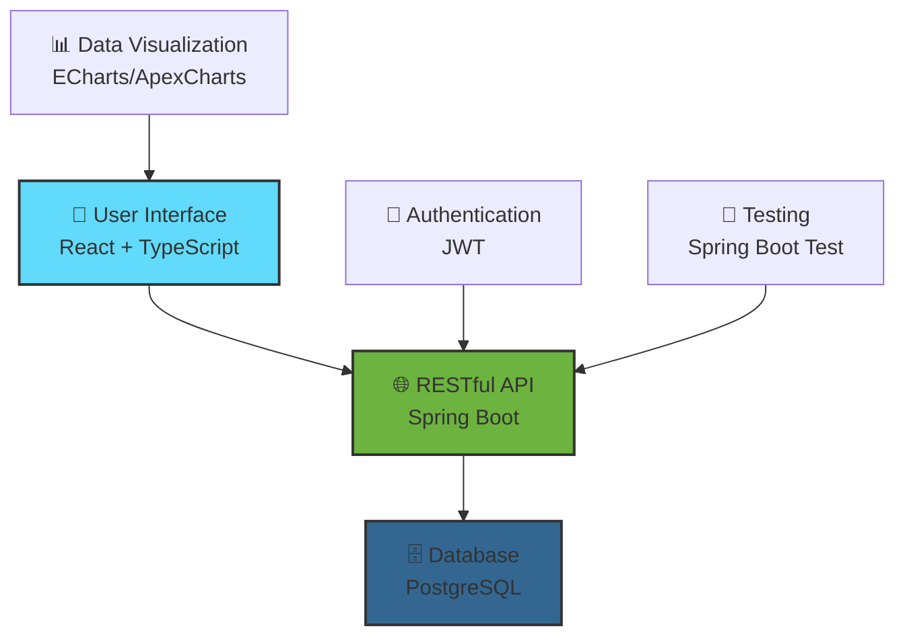

# 🛒 Đi Chợ Tiện Lợi - Smart Shopping Management System

<div align="center">
  
  
  
  [](https://github.com/MaiVanDang/ITSS)
  [](LICENSE)
  [](https://reactjs.org/)
  [](https://spring.io/projects/spring-boot)
  [](https://www.postgresql.org/)

  <h3>🎯 Hệ thống quản lý mua sắm thông minh, giảm thiểu lãng phí thực phẩm</h3>
  
  <p><strong>ONE LOVE. ONE FUTURE.</strong></p>
  
  
  
  
</div>

---

## 📋 Mục Lục

- [🌟 Giới Thiệu](#-giới-thiệu)
- [✨ Tính Năng Chính](#-tính-năng-chính)
- [🏗️ Kiến Trúc Hệ Thống](#️-kiến-trúc-hệ-thống)
- [💻 Công Nghệ Sử Dụng](#-công-nghệ-sử-dụng)
- [🚀 Cài Đặt và Chạy Dự Án](#-cài-đặt-và-chạy-dự-án)
- [📱 Hướng Dẫn Sử Dụng](#-hướng-dẫn-sử-dụng)
- [🧪 Kiểm Thử](#-kiểm-thử)
- [🔮 Kế Hoạch Phát Triển](#-kế-hoạch-phát-triển)
- [👥 Đóng Góp](#-đóng-góp)
- [📄 Giấy Phép](#-giấy-phép)

---

## 🌟 Giới Thiệu

**Đi Chợ Tiện Lợi** là một hệ thống quản lý mua sắm thông minh được phát triển bởi **Nhóm 3** tại Trường Đại học Bách Khoa Hà Nội, dưới sự hướng dẫn của **Ths. Nguyễn Mạnh Tuấn**.

### 🎯 Mục Tiêu
- Tối ưu hóa quá trình mua sắm và quản lý thực phẩm
- Giảm thiểu lãng phí thực phẩm thông qua theo dõi hạn sử dụng
- Hỗ trợ chia sẻ và phân công nhiệm vụ trong nhóm/gia đình
- Đề xuất món ăn thông minh từ nguyên liệu có sẵn

---

## ✨ Tính Năng Chính

<div align="center">
  <table>
    <tr>
      <td align="center" width="25%">
        <h3>🛍️ Quản Lý Mua Sắm</h3>
        <p>Tạo và quản lý danh sách mua sắm thông minh với khả năng chia sẻ nhóm</p>
      </td>
      <td align="center" width="25%">
        <h3>🍎 Theo Dõi Thực Phẩm</h3>
        <p>Giám sát hạn sử dụng và nhận cảnh báo kịp thời</p>
      </td>
      <td align="center" width="25%">
        <h3>🍳 Đề Xuất Món Ăn</h3>
        <p>Gợi ý công thức nấu ăn từ nguyên liệu có sẵn</p>
      </td>
      <td align="center" width="25%">
        <h3>👥 Làm Việc Nhóm</h3>
        <p>Phân công nhiệm vụ và chia sẻ thông tin hiệu quả</p>
      </td>
    </tr>
  </table>
</div>

### 🔧 Chi Tiết Tính Năng

#### 👤 **Quản Lý Người Dùng & Nhóm**
- 🔐 Đăng ký/đăng nhập với phân quyền (Guest, User, Admin)
- 👥 Tạo và tham gia nhóm
- 🎯 Phân công nhiệm vụ cho thành viên

#### 🥗 **Quản Lý Thực Phẩm**
- ➕ Thêm/sửa/xóa thực phẩm trong tủ lạnh
- ⏰ Theo dõi hạn sử dụng tự động
- 🚨 Cảnh báo thực phẩm sắp hết hạn

#### 🍽️ **Quản Lý Món Ăn & Công Thức**
- 📝 Thêm và lưu trữ công thức nấu ăn
- 🤖 Đề xuất món ăn từ nguyên liệu có sẵn
- 📊 Phân tích dinh dưỡng (kế hoạch phát triển)

#### 🛒 **Quản Lý Đơn Mua Sắm**
- 📋 Tạo danh sách mua sắm từ công thức
- 🔄 Chia sẻ và đồng bộ với nhóm
- ✅ Theo dõi tiến độ mua sắm

---

## 🏗️ Kiến Trúc Hệ Thống



---

## 💻 Công Nghệ Sử Dụng

### 🎨 **Frontend**
| Công nghệ | Phiên bản | Mô tả |
|-----------|-----------|-------|
|  | 18.0+ | Thư viện JavaScript cho UI |
|  | 5.0+ | Ngôn ngữ lập trình có kiểu |
|  | 5.0+ | Thư viện biểu đồ tương tác |

### ⚙️ **Backend**
| Công nghệ | Phiên bản | Mô tả |
|-----------|-----------|-------|
|  | 17+ | Ngôn ngữ lập trình chính |
|  | 3.0+ | Framework phát triển web |
|  | 15+ | Hệ quản trị CSDL |

### 🛠️ **Công Cụ Phát Triển**
- **Visual Studio Code** - IDE chính cho Frontend
- **IntelliJ IDEA** - IDE cho Java/Spring Boot
- **Spring Boot Starter Test** - Framework kiểm thử

---

## 🚀 Cài Đặt và Chạy Dự Án

### 📋 **Yêu Cầu Hệ Thống**
-  Java 17 hoặc cao hơn
-  Node.js 18 hoặc cao hơn
-  PostgreSQL 15 hoặc cao hơn
-  Git

### 🔧 **Cài Đặt**

#### 1️⃣ **Clone Repository**
```bash
git clone https://github.com/MaiVanDang/ITSS.git
cd ITSS
```

#### 2️⃣ **Thiết Lập Database**
```sql
-- Tạo database PostgreSQL
CREATE DATABASE dicho_tienloi;
CREATE USER dicho_user WITH PASSWORD 'your_password';
GRANT ALL PRIVILEGES ON DATABASE dicho_tienloi TO dicho_user;
```

#### 3️⃣ **Cấu Hình Backend**
```bash
cd backend
cp application.properties.example application.properties
```

Chỉnh sửa `application.properties`:
```properties
# Database Configuration
spring.datasource.url=jdbc:postgresql://localhost:5432/dicho_tienloi
spring.datasource.username=dicho_user
spring.datasource.password=your_password
spring.jpa.hibernate.ddl-auto=update

# Server Configuration
server.port=8080
```

#### 4️⃣ **Cài Đặt Dependencies Backend**
```bash
# Trong thư mục backend
./mvnw clean install
```

#### 5️⃣ **Cài Đặt Dependencies Frontend**
```bash
cd ../frontend
npm install
```

### 🎬 **Chạy Ứng Dụng**

#### 🔥 **Chạy Backend**
```bash
cd backend
./mvnw spring-boot:run
```
> 🌐 Backend sẽ chạy tại: http://localhost:8080

#### 🎨 **Chạy Frontend**
```bash
cd frontend
npm start
```
> 🌐 Frontend sẽ chạy tại: http://localhost:3000

### 🐳 **Chạy với Docker (Tùy chọn)**
```bash
docker-compose up -d
```

---

## 📱 Hướng Dẫn Sử Dụng

### 🎯 **Bước 1: Đăng Ký/Đăng Nhập**
1. Truy cập http://localhost:3000
2. Đăng ký tài khoản mới hoặc đăng nhập
3. Chọn vai trò phù hợp (User/Admin)

### 👥 **Bước 2: Tạo/Tham Gia Nhóm**
1. Tạo nhóm mới hoặc tham gia nhóm có sẵn
2. Mời thành viên qua email hoặc mã nhóm
3. Phân quyền cho các thành viên

### 🥗 **Bước 3: Quản Lý Thực Phẩm**
1. Thêm thực phẩm vào tủ lạnh/kho
2. Nhập thông tin hạn sử dụng
3. Theo dõi cảnh báo hết hạn

### 🛒 **Bước 4: Tạo Danh Sách Mua Sắm**
1. Tạo danh sách mua sắm mới
2. Thêm sản phẩm cần mua
3. Chia sẻ với nhóm và phân công

### 🍳 **Bước 5: Khám Phá Món Ăn**
1. Xem đề xuất món ăn từ nguyên liệu có sẵn
2. Thêm công thức nấu ăn yêu thích
3. Lên kế hoạch bữa ăn cho tuần

---

## 🧪 Kiểm Thử

### 🔍 **Chạy Unit Tests**
```bash
# Backend Tests
cd backend
./mvnw test


### 📊 **Kiểm Tra Coverage**
```bash
# Backend Coverage
./mvnw jacoco:report

### 🌐 **Integration Tests**
```bash
./mvnw test -Dtest=*IntegrationTest
```

---

## 🔮 Kế Hoạch Phát Triển

### 🎯 **Version 2.0 - Q3 2025**
- [ ] 🤖 Tích hợp AI cho đề xuất dinh dưỡng
- [ ] 📱 Phát triển ứng dụng mobile
- [ ] 🔔 Hệ thống thông báo real-time
- [ ] 📈 Analytics và báo cáo chi tiết

### 🎯 **Version 2.1 - Q4 2025**
- [ ] 🛒 Tích hợp với cửa hàng trực tuyến
- [ ] 💰 Theo dõi ngân sách mua sắm
- [ ] 🌍 Hỗ trợ đa ngôn ngữ
- [ ] ☁️ Backup và đồng bộ cloud

### 🎯 **Version 3.0 - Q1 2026**
- [ ] 🏪 Hệ thống khuyến mãi và coupon
- [ ] 🤝 Mạng xã hội chia sẻ công thức
- [ ] 📊 Machine Learning cho dự đoán nhu cầu
- [ ] 🎮 Gamification và rewards

---

## 👥 Đóng Góp

Chúng tôi hoan nghênh mọi đóng góp từ cộng đồng! 

### 🚀 **Cách Đóng Góp**
1. Fork repository
2. Tạo feature branch (`git checkout -b feature/AmazingFeature`)
3. Commit changes (`git commit -m 'Add some AmazingFeature'`)
4. Push to branch (`git push origin feature/AmazingFeature`)
5. Tạo Pull Request

### 📝 **Quy Tắc Đóng Góp**
- Tuân thủ coding standards
- Viết tests cho features mới
- Cập nhật documentation
- Sử dụng commit message rõ ràng

### 🐛 **Báo Cáo Lỗi**
Tạo issue trên GitHub với thông tin:
- Mô tả lỗi chi tiết
- Các bước tái tạo lỗi
- Screenshots (nếu có)
- Thông tin môi trường

---

## 📞 Liên Hệ & Hỗ Trợ

<div align="center">
  
  **🏫 Trường Đại học Bách Khoa Hà Nội**
  
  [](http://www.hust.edu.vn)
  [](https://github.com/MaiVanDang/ITSS)
  
  **👨‍🏫 Giảng viên hướng dẫn:** Ths. Nguyễn Mạnh Tuấn
  
  **👥 Nhóm phát triển:** Nhóm 3 - ITSS 2024
  
</div>

---

## 📄 Giấy Phép

Distributed under the MIT License. See `LICENSE` for more information.

---

<div align="center">
  
  **🎓 Đại học Bách Khoa Hà Nội - Hanoi University of Science and Technology**
  
  
  
  **"ONE LOVE. ONE FUTURE."**
  
  ---
  
  <p>⭐ Nếu dự án này hữu ích, hãy cho chúng tôi một star trên GitHub!</p>
  
  <p>Made with ❤️ by Mai Văn Đăng</p>
  
</div>
